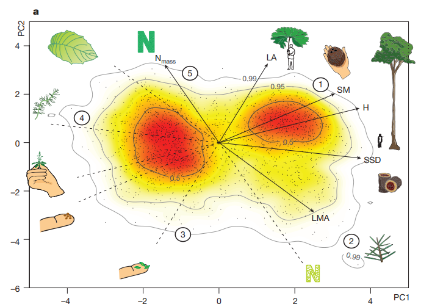

```{r setup, include=FALSE}
knitr::opts_chunk$set(echo = FALSE)

ksource <- function(x, ...) {
  source(knitr::purl(x, output = tempfile()), ...)
}
ksource("paper_reimplentation.Rmd")
ksource("groot_test.Rmd")

```
## Background

**The global spectrum of plant form and function**

Díaz et al. (2016) - Nature



## Research question

Global spectrum of plants - Using additional traits

New data sets:

- GRooT (Global Root Trait) Database

- GIFT (Global Inventory of Floras and Traits)

## Reimplementation of Díaz paper

- Accessing TRY database

- 

## Selection of traits


