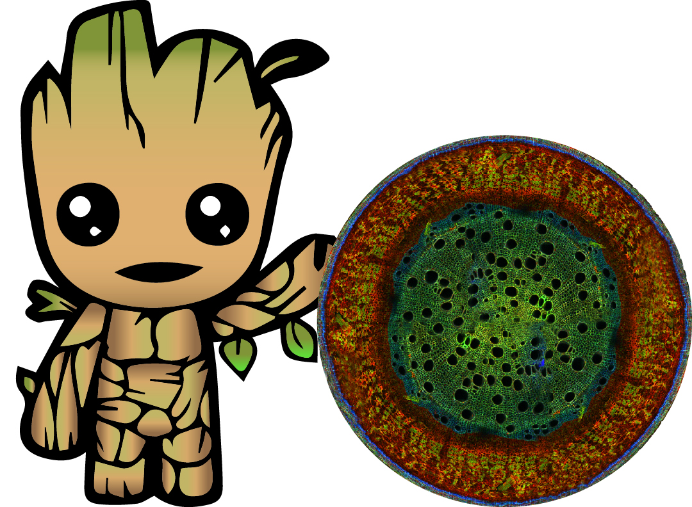

```{r setup, include=FALSE}
knitr::opts_chunk$set(echo = FALSE)

library(readr)
library(stringr)
source_rmd <- function(file_path) {
  stopifnot(is.character(file_path) && length(file_path) == 1)
  .tmpfile <- tempfile(fileext = ".R")
  .con <- file(.tmpfile) 
  on.exit(close(.con))
  full_rmd <- read_file(file_path)
  codes <- str_match_all(string = full_rmd, pattern = "```(?s)\\{r[^{}]*\\}\\s*\\n(.*?)```")
  stopifnot(length(codes) == 1 && ncol(codes[[1]]) == 2)
  codes <- paste(codes[[1]][, 2], collapse = "\n")
  writeLines(codes, .con)
  flush(.con)
  cat(sprintf("R code extracted to tempfile: %s\nSourcing tempfile...", .tmpfile))
  source(.tmpfile)
}

```

```{r load, include = FALSE, cache=TRUE}
source_rmd("paper_reimplentation.Rmd")
source_rmd("groot_test.Rmd")
```

```{r , include = FALSE}
library(cowplot)
library(ggplot2)
library(tidyverse)
library(FactoMineR)
library(psych)
theme_set(theme_bw())
```


## Background

**The global spectrum of plant form and function**

Díaz et al. (2016) - Nature

```{r Diaz}
ggplot() +
  draw_image("Figures/Diaz_Figure_2.png")
```


## Research question

Global spectrum of plants - Using additional traits

New data sets:

- GRooT (Global Root Trait) Database

- GIFT (Global Inventory of Floras and Traits)

## Reimplementation of Díaz paper

- Accessing TRY database

- Selection of traits

- Removing outliers

- Normalization and log-transformation

- PCA (Principal Component Analysis)

## Selection of traits

```{r traits}
ggplot(miss_traits_plants, aes(perc_na, trait)) +
  geom_bar(stat="identity") +
  labs(x="Percentage of missing data", y="Trait", title = "Missing data in TRY database")
```

## Removing outliers

```{r outliers}
pairs.panels(plants_pca,
density = FALSE, ellipses = FALSE, hist.col = "grey")
```

## Normalization and log-transformation of data

```{r normalization}
pairs.panels(plants_pca3,
density = FALSE, ellipses = FALSE, hist.col = "grey")
```

## PCA (Principal Component Analysis)

```{r PCA1}
plot1 <- ggplot() +
  draw_image("Figures/Diaz_Figure_2.png") +
  scale_x_continuous(expand = c(0,0)) +
  scale_y_continuous(expand = c(0,0))

plot2 <- plot.PCA(pca3, choix = "var", graph.type = "ggplot")

plot_grid(plot1, plot2)
```

## PCA (Principal Component Analysis) - Dividing between woody and non-woody species

```{r woody}
plot1b <- ggplot() +
  draw_image("Figures/Diaz_Figure_2b.png") +
  scale_x_continuous(expand = c(0,0)) +
  scale_y_continuous(expand = c(0,0))

plot3 <- ggplot(pca3_coords, aes(Dim.1, Dim.2, colour=woody)) +
  geom_point() +
  scale_color_manual(values = c("woody" = "brown", "non-woody" = "green")) +
  theme(legend.position = "bottom",
        legend.title = element_blank())

plot_grid(plot1b, plot3)
```


## GRooT data set - Selection of traits



```{r groot1}
ggplot(miss_traits, aes(perc_na, trait)) +
  geom_bar(stat="identity") +
  labs(x="Percentage of missing data", y="Trait")
```


## GRooT data set - PCA


```{r groot2}
plot4 <- plot.PCA(pca_t4, choix = "var")
plot5 <- plot.PCA(pca_t4, choix = "ind", label = "none")

plot_grid(plot4, plot5)
```


## GIFT (Global Inventory of Floras and Traits) data set


<br/>
<br/>
<br/>

- Trait variables are both continuous and categorical --> regular PCA not possible

- Usage of PCoA (Principal Coordinates Analysis)

## Final data analysis

<br/>
<br/>

- Select most important traits from each data set

- Merge selected traits to 1-2 data sets

- Performance of PCA/PCoA